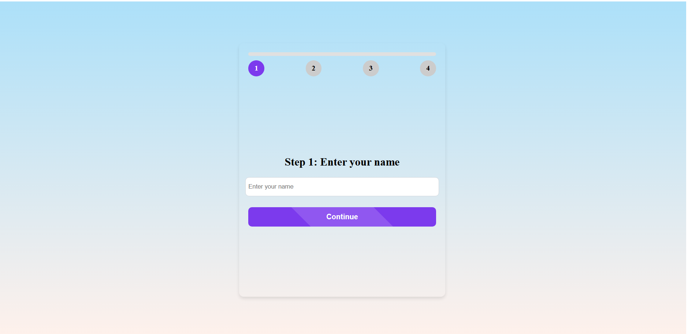

# 🗨️ Decentralized Chat App with Celestia

## 🚀 Giới thiệu
Chào mừng bạn đến với **Decentralized Chat App**, một ứng dụng nhắn tin phi tập trung giúp bạn kết nối với bạn bè và cộng đồng một cách an toàn và bảo mật. Với sự hỗ trợ của **Celestia**, ứng dụng không chỉ cho phép nhắn tin, tạo nhóm mà còn tích hợp **bình chọn bằng token**, giúp các thành viên đưa ra quyết định và nhận phần thưởng xứng đáng.

## 🎯 Tính năng nổi bật
- 💬 **Nhắn tin cá nhân & nhóm**: Giao tiếp dễ dàng với bạn bè hoặc lập nhóm trò chuyện.
- 🔗 **Tích hợp ví với Celestia**: Lưu trữ tin nhắn phi tập trung, đảm bảo quyền riêng tư tối đa.
- 🗳️ **Bình chọn bằng token**: Sử dụng số token trong ví để tham gia bình chọn ngay trong phòng chat.
- 🎁 **Trả thưởng minh bạch**: Thành viên dự đoán đúng sẽ nhận được phần thưởng từ hệ thống.
- 🏆 **Bảng xếp hạng**: Thống kê và hiển thị người có nhiều lượt bình chọn chính xác nhất.
- 🔒 **Mã hóa & bảo mật dữ liệu**: Mọi tin nhắn đều được mã hóa, bảo vệ tối đa quyền riêng tư.
- 🌍 **Giao diện trực quan & dễ sử dụng**: Thiết kế hiện đại, trải nghiệm mượt mà.

## 🏗️ Công nghệ sử dụng
- **Frontend**: Vue.js (UI linh hoạt và mượt mà)
- **Backend**: Node.js / Express.js (Xử lý nhanh, mạnh mẽ)
- **Blockchain**: Celestia (Lưu trữ tin nhắn và thông tin ví một cách phi tập trung)
- **Database**: MongoDB / Firebase / Celestia (Lưu trữ dữ liệu người dùng và token)
- **Authentication**: Wallet-based login (MetaMask, WalletConnect,...)
- **Realtime Database**: Firebase (Đồng bộ dữ liệu tức thời)

## 🖼️ Hình ảnh minh họa



## 📦 Cài đặt & Chạy thử
```sh
# Clone repository
$ git clone https://github.com/your-repo/appchat-celestia.git
$ cd appchat-celestia

# Cài đặt dependencies
$ npm install

# Chạy ứng dụng
$ npm run dev

# Chạy server
$ node src/app.js
```

## 🌟 Đóng góp
Mọi đóng góp từ cộng đồng đều được hoan nghênh! Hãy tạo **Pull Request** hoặc **Issue** để thảo luận và cải tiến ứng dụng.

## 📜 Giấy phép
Dự án được phát hành theo giấy phép **VHU**, bạn có thể sử dụng và phát triển thêm theo nhu cầu.

---
✉️ **Liên hệ**: Nếu có bất kỳ câu hỏi nào, hãy kết nối với chúng tôi qua email hoặc Telegram! 🚀

